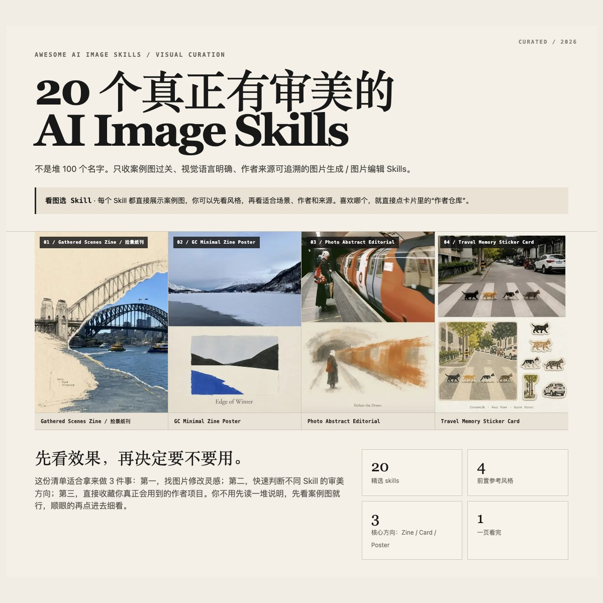
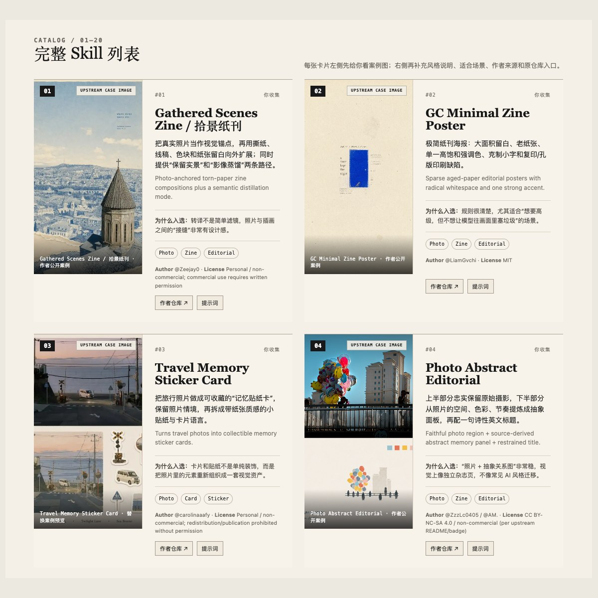

# Awesome AI Image Skills

> 20 个真正有审美的 AI Image Skills：照片编辑、Zine、海报、卡片、封面、社交视觉。  
> A visual-first curation of AI image skills with real examples, original authors, source links, license signals and copy-ready prompts.

**🌐 Live Demo:** https://bryceyuuu.github.io/awesome-ai-image-skills/

<!-- README_PREVIEW_START -->

  
  

<!-- README_PREVIEW_END -->

**Keywords:** AI image skills · Codex skills · Claude Code skills · image editing · image generation · photo editing · zine poster · editorial design · Xiaohongshu / RedNote · risograph · agent skills · prompt engineering

## Why this repo

GitHub 上视觉 Skill 很多，但真正的问题不是“找不到”，而是案例不够直观、审美质量不稳定、来源和 License 不清楚。这个仓库只做一件事：**先看成品，再决定要不要用。**

- **Visual-first** — 每个项目都有真实公开案例。
- **Source-first** — 保留原作者和原仓库，不重新包装成自己的 Skill。
- **Prompt-ready** — 每个 Skill 都整理了可复制的长版提示词。
- **License-aware** — 非商业、限制再分发、未附 License 的项目都会标注。
- **No mirror** — 这是策展目录，不镜像第三方 Skill 代码。

## 20 Skills

| # | Skill | Best for | Author | License |
|---:|---|---|---|---|
| 01 | [Gathered Scenes Zine / 拾景纸刊](https://github.com/Zeejay0/gathered-scenes-zine-skill) | Photo → Zine / Editorial | Zeejay0 | Personal / non-commercial; commercial use requires written permission |
| 02 | [GC Minimal Zine Poster](https://github.com/LiamGvchi/gc-minimal-zine-poster) | Photo → Zine / Editorial | LiamGvchi | MIT |
| 03 | [Travel Memory Sticker Card](https://github.com/carolinaaafy/travel-memory-sticker-card) | Photo → Card / Sticker / Archive | carolinaaafy | Personal / non-commercial; redistribution/publication prohibited without permission |
| 04 | [Photo Abstract Editorial](https://github.com/ZzzLc0405/photo-abstract-editorial) | Photo → Zine / Editorial | ZzzLc0405 / @AM. | CC BY-NC-SA 4.0 / non-commercial (per upstream README/badge) |
| 05 | [Make Photo Stamp Archive](https://github.com/Dlcccc71913/skill-make-photo-stamp-archive) | Photo → Card / Sticker / Archive | Dlcccc71913 | MIT |
| 06 | [XHS Cover Skill / 小红书封面生成器](https://github.com/Vivixiao980/xhs-cover-skill) | Social / Cover / IP | Vivi (@Vivixiao980) | MIT |
| 07 | [Photo Riso Poster](https://github.com/luckdvr/photo-riso-poster) | Photo → Zine / Editorial | luckdvr | MIT |
| 08 | [Pixel Style Poster Skill](https://github.com/v92388375-gif/pixel-style-poster-skill) | Specialized Visual Transformation | v92388375-gif | MIT |
| 09 | [Ink Wash Poster](https://github.com/TwentyfiveBTea/ink-wash-poster) | Photo → Zine / Editorial | TwentyfiveBTea | AGPL-3.0 |
| 10 | [Travel Photo Soft Abstraction](https://github.com/wnby/travel-photo-soft-abstraction) | Photo → Zine / Editorial | wnby | No LICENSE file found at review time |
| 11 | [Travel Photo Abstraction](https://github.com/Evianis/travel-photo-abstraction) | Photo → Zine / Editorial | Evianis | Source-available; derivatives/redistribution/republication prohibited |
| 12 | [PaperEcho / Photo to Art Card](https://github.com/Yu-0312/paper-echo-photo-cards) | Photo → Card / Sticker / Archive | Yu-0312 | MIT for skill/docs; example images excluded from MIT |
| 13 | [Qingyun IP Poster](https://github.com/qingyunAGI/qingyun-ip-poster) | Social / Cover / IP | 彭青云 (Kaiwen) / @qingyunAGI | No open license attached at review time |
| 14 | [Yingzao · 营造](https://github.com/op7418/guizang-yingzao-skill) | Specialized Visual Transformation | op7418 | No LICENSE file found at review time |
| 15 | [Retro Stilllife Photography](https://github.com/qianyuning/retro-stilllife-photography) | Specialized Visual Transformation | qianyuning | No LICENSE file found at review time |
| 16 | [Photo to Monthly Zine Postcard](https://github.com/shenchangyi/photo-to-monthly-zine-postcard) | Photo → Zine / Editorial | shenchangyi | MIT |
| 17 | [Guizang Social Card Skill](https://github.com/op7418/guizang-social-card-skill) | Social / Cover / IP | op7418 | AGPL-3.0 |
| 18 | [Street Photo Illustration](https://github.com/dacnay816y62-hub/street-photo-illustration-skill) | Specialized Visual Transformation | FANTASY / dacnay816y62-hub | No LICENSE file found at review time |
| 19 | [Photo Revival / 废片焕新](https://github.com/dacnay816y62-hub/photo-revival) | Photo → Zine / Editorial | FANTASY / dacnay816y62-hub | MIT |
| 20 | [FANTASY 奇奇怪怪](https://github.com/dacnay816y62-hub/fantasy-qiqiguaiguai-skill) | Social / Cover / IP | FANTASY / dacnay816y62-hub | MIT |

## Prompt Cheatsheet

完整长版提示词见 **[PROMPTS.md](PROMPTS.md)**。网页版本可以直接点每张卡片里的 **「提示词」→「一键复制」**。

## GitHub Pages

本仓库根目录已经包含 `index.html`。启用 GitHub Pages 后，网页地址为：

https://bryceyuuu.github.io/awesome-ai-image-skills/

## Contributing

欢迎推荐真正有视觉辨识度的 Skill。请提交仓库、作者、案例图、License / 使用限制，以及“为什么它值得进这个列表”。详见 [CONTRIBUTING.md](CONTRIBUTING.md)。

## License & attribution

本仓库自己的目录代码与页面结构使用 MIT License。第三方 Skill、文档、提示词、商标与案例图仍归各自作者所有，并受上游许可证和使用条款约束。